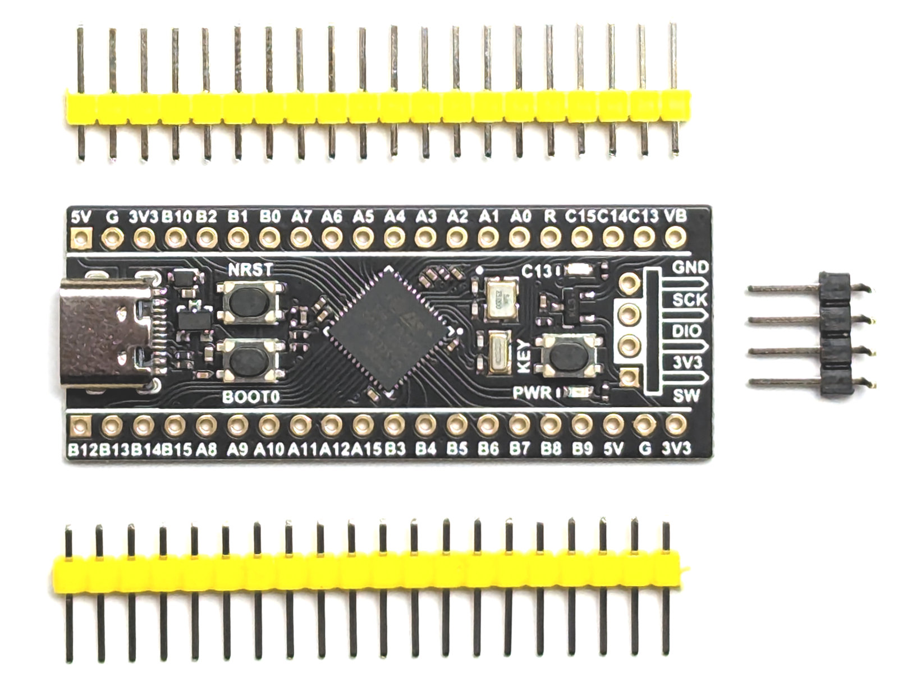
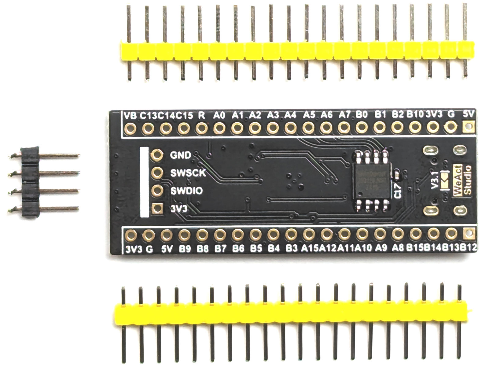
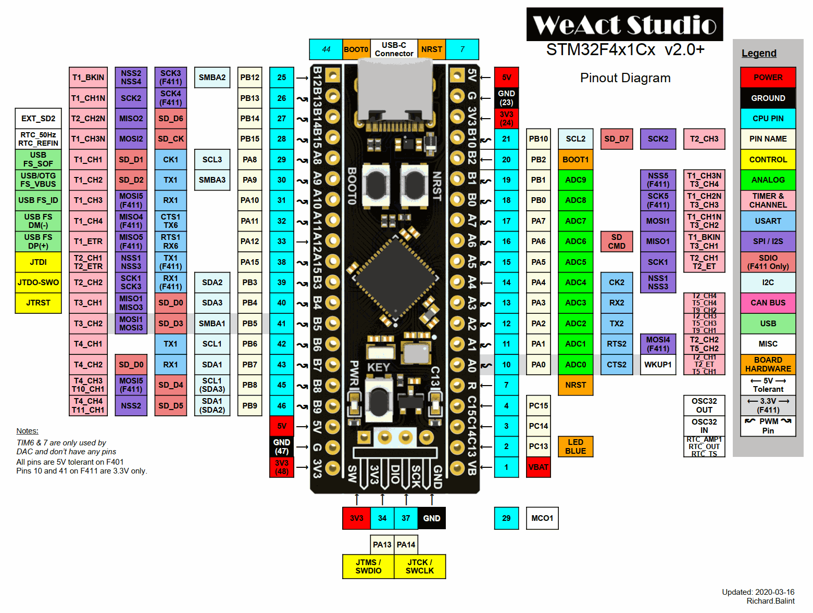
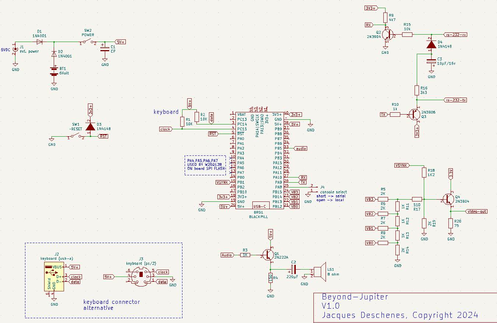
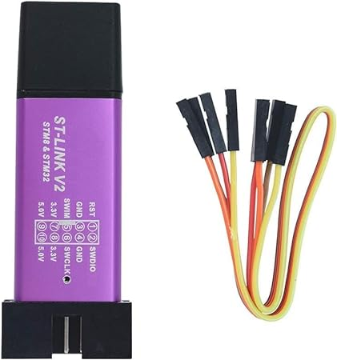

# Beyond-Jupiter 

À fin des années 70 et durant les années 80 les ordinateurs personnels basés sur des processeurs 8 bits comme le 6502 et le Z80 incorporaient tous dans une mémoire ROM un interpréteur BASIC. Cependant il y a eu une exception le [Juputer ACE](https://en.wikipedia.org/wiki/Jupiter_Ace) mit en marché en 1982. Ce dernier incorporait un interpréteur Forth. Malheureusement ce ne fut pas un succès commercial.  

Le **Jupiter-ACE** a été mis au point par des ingénieurs qui avaient travaillé sur les **ZX80** et **ZX81** de Sinclair. Ils ont formé leur propre compagnie [Jupiter Canlab limited](https://en.wikipedia.org/wiki/Jupiter_Cantab). Cet ordinateur utilisait aussi un processeur **Z80**.

Depuis 1982 la technologie a grandement progressée ainsi que l'exploration spatiale. Plusieurs sondes se sont rendues au delà de Jupiter et certaines ont même quittées le système solaire. 

**Beyond-Jupiter** est un ordinateur basé sur un processeur 32 bits Cortex-M4 avec unitée en virgule flottante de 32 bits incorporée. Comme le [Jupiter ACE](https://en.wikipedia.org/wiki/Jupiter_Ace) il incorpore un interpréteur Forth en mémoire FLASH. Pour l'essentiel cet interpréteur respecte le standard [Forth 2012](https://forth-standard.org/).


# Conception matérielle

Le coeur de cet ordinateur est une carte black-pill comprenant un processeur **STM32F411CEU6** et une mémoire FLASH SPI de **16 MO** utilisée pour le système de fichier.

## BLACK-PILL 

source: [WeAct black pill V3.1](https://universal-solder.ca/product/stm32f411ceu6-black-pill-128m-flash/)



* MCU  STM32F411CEU6
    * mémoire FLASH 512Ko
    * mémoire RAM 128ko 
    * Fclk maximal  100Mhz 

 

La carte que j'ai en main a les composants C15 (100nF) et U3 (25Q128JVSQ, mémoire flash SPI de 16Mo) installés.

## Pinout




## Affichage Vidéo 

* Sortie NTSC composite 
* graphiques  
    * graphique 320x200 pixels 
    * 16 niveaux de gris 
* texte 
    * 25 lignes 
    * 53 charactères par ligne

* Clavier PS/2

* Audio 1 tonalité de fréquence et durée programmables.

## Schematic 



## Pour compiler 
```
jacques@picatout:~/github/beyond-Jupiter$ make -B
rm -f build/*
arm-none-eabi-as  -march=armv7m -mfpu=vfpv4 -mfloat-abi=hard  -a=build/stm32eforth.lst init.s environment.s ser-term.s tvout.s ps2_kbd.s spi-flash.s fpu.s strtof.s ftoa.s forth.s  -g -obuild/stm32eforth.o
arm-none-eabi-ld -T stm32f411ce.ld  -g build/stm32eforth.o -o build/stm32eforth.elf
arm-none-eabi-objcopy -O binary build/stm32eforth.elf build/stm32eforth.bin 
arm-none-eabi-objdump -D build/stm32eforth.elf > build/stm32eforth.dasm
arm-none-eabi-objdump -D build/stm32eforth.elf > build/stm32eforth.dasm
```

## Flasher le binaire 

Un petit programmeur économique comme celui-ci fait très bien l'affaire.
.

Dans le Makefile les variables suivantes indiquent le type de programmeur utilisé et le numéro de série. Ces paramètres doivent-être ajustés pour en fonction STLINK V2 utilisé.


```
# programmer
VERSION=STLINKV2
STM_PROG=553f6a06663f56493953103f
SMALL_DUNGLE=48FF6E066772574857351967 
STV2_DUNGLE=$(SMALL_DUNGLE)
STV3_PROG_SN=
SERIAL=$(STV2_DUNGLE)
```

Pour connaître le numéro de série du programmeur
```
jacques@picatout:~/github/beyond-Jupiter$ st-info --probe
Found 1 stlink programmers
  version:    V2J40S7
  serial:     48FF6E066772574857351967
  flash:      524288 (pagesize: 16384)
  sram:       131072
  chipid:     0x0431
  descr:      stm32f411re
```

Pour flasher le binaire 
```
jacques@picatout:~/github/beyond-Jupiter$ make flash
************************
	 FLASHING DEVICE       
************************
st-flash  --serial=48FF6E066772574857351967   write build/stm32eforth.bin 0x8000000
st-flash 1.7.0
2024-03-14T21:14:22 INFO common.c: stm32f411re: 128 KiB SRAM, 512 KiB flash in at least 16 KiB pages.
file build/stm32eforth.bin md5 checksum: 3c52bf457f28dd76db5e2a525052fa8a, stlink checksum: 0x001e7956
2024-03-14T21:14:22 INFO common.c: Attempting to write 28308 (0x6e94) bytes to stm32 address: 134217728 (0x8000000)
EraseFlash - Sector:0x0 Size:0x4000 2024-03-14T21:14:22 INFO common.c: Flash page at addr: 0x08000000 erased
EraseFlash - Sector:0x1 Size:0x4000 2024-03-14T21:14:23 INFO common.c: Flash page at addr: 0x08004000 erased
2024-03-14T21:14:23 INFO common.c: Finished erasing 2 pages of 16384 (0x4000) bytes
2024-03-14T21:14:23 INFO common.c: Starting Flash write for F2/F4/F7/L4
2024-03-14T21:14:23 INFO flash_loader.c: Successfully loaded flash loader in sram
2024-03-14T21:14:23 INFO flash_loader.c: Clear DFSR
2024-03-14T21:14:23 INFO common.c: enabling 32-bit flash writes
2024-03-14T21:14:23 INFO common.c: Starting verification of write complete
2024-03-14T21:14:23 INFO common.c: Flash written and verified! jolly good!
```